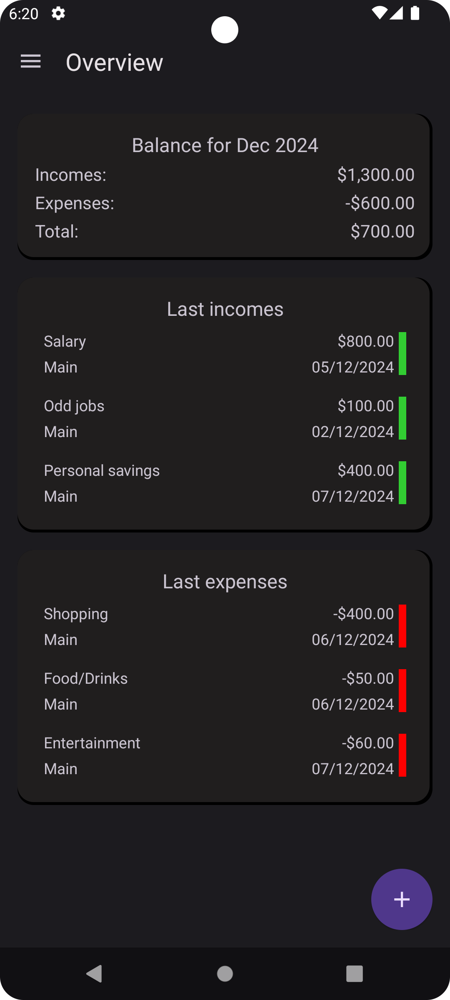
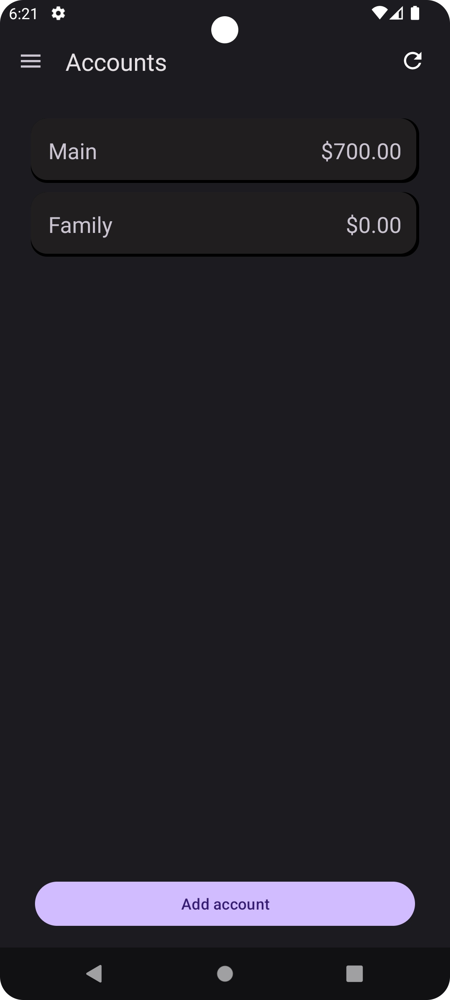
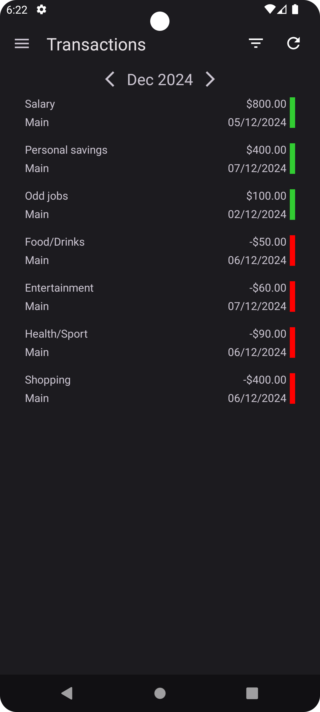
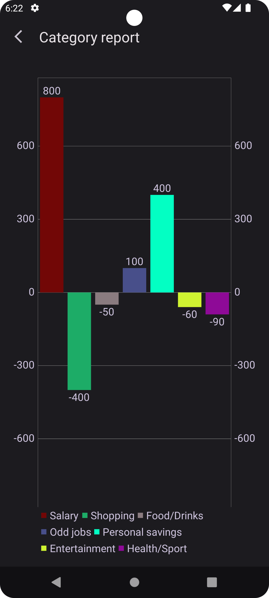
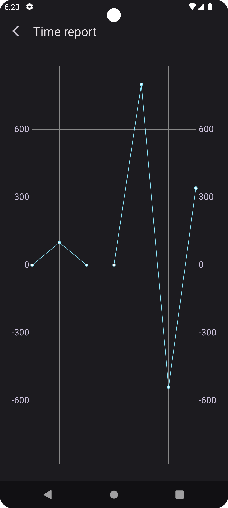
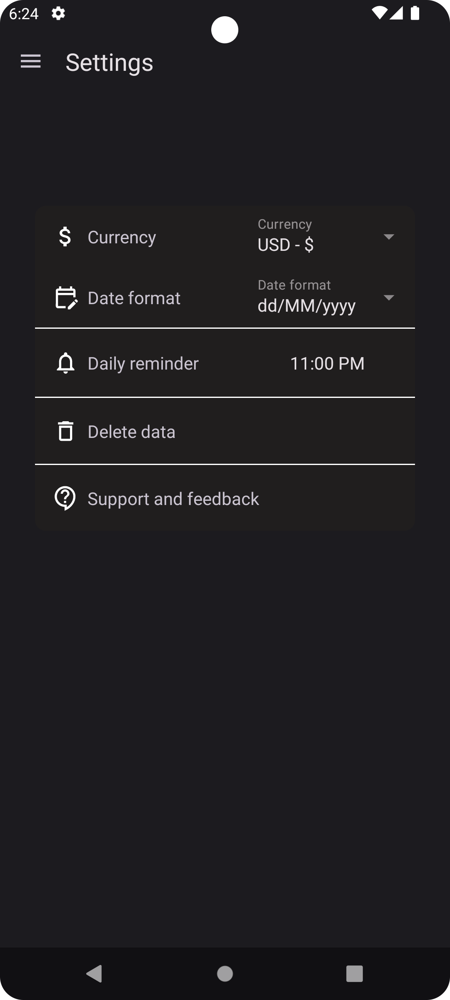

# Budgetracker

Budgetracker is an Android app designed to help users efficiently manage their budgets. The app enables users to track incomes and expenses, manage multiple accounts, create category, time, and PDF reports.

## Technologies
* Kotlin
* XML
* Jetpack Navigation
* Hilt
* Room
* Coroutines
* View Model

## Functionality

1. **Overview screen:**
   Displays an overview of the user's financial activity for the current month, including totals for incomes, expenses, and remaining budget.

   

      
   

2. **Accounts:**
   Lists all user accounts. Tapping on an account provides detailed information about its balance.

   

      
   

3. **Transactions screen:**
   Displays all transactions for a selected month. Users can filter transactions by type of transaction (income or outcome) and account and also sort by date and value. Tapping on a transaction opens a detailed dialog with transaction information.

   

      
   

4. **Category report:**
   Visualizes spending or income data grouped by categories. Users can customize the report by selecting type of transaction, account and date range.

   

      
   

5. **Time report:**
   Generates time-based reports to track financial trends over specific periods. Users can adjust parameters such as type of transaction, account, time period (day, week, month or year) and date range

   

      
   

6. **Settings:**
   Allows users to customize their experience by selecting a preferred currency, setting the date format and enabling a daily reminder to add new transaction.

   

      
   
